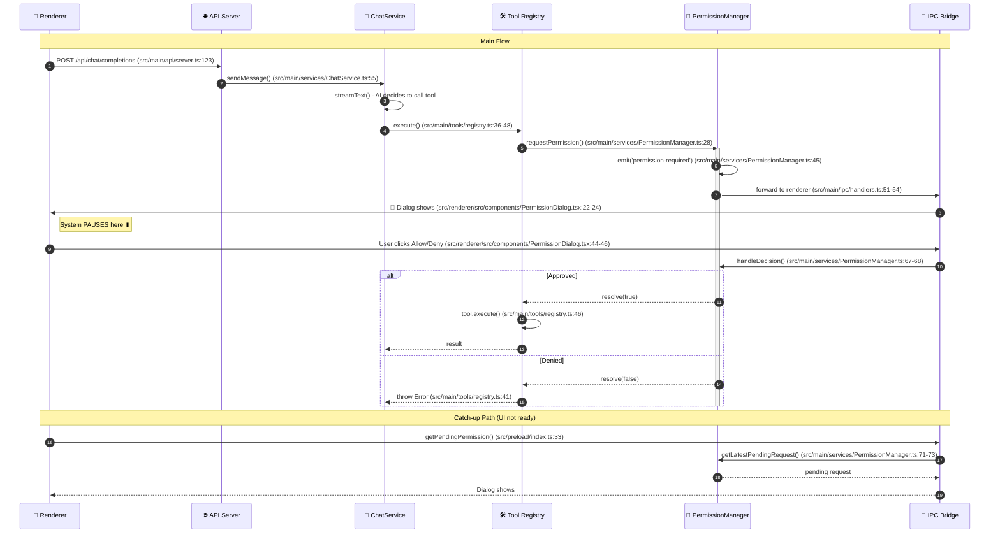

# Tool Call Flow

## Main Flow

```
Renderer                          Main Process
────────                          ────────────

User sends message
       │
       │  HTTP POST /api/chat/completions
       │  (src/main/api/server.ts:123)
       ▼
                                  chatService.sendMessage()
                                  (src/main/services/ChatService.ts:55)
                                         │
                                         │  streamText() with tools
                                         ▼
                                  AI decides to call bash
                                         │
                                         │  registry execute()
                                         │  (src/main/tools/registry.ts:36-48)
                                         ▼
                                  permissionManager.requestPermission()
                                  (src/main/services/PermissionManager.ts:28-63)
                                         │
                                         │  emit('permission-required')
                                         │  (src/main/services/PermissionManager.ts:45)
                                         ▼
                                  IPC handler forwards to renderer
                                  (src/main/ipc/handlers.ts:51-54)
                                         │
       ┌─────────────────────────────────┘
       │  ipcRenderer.on('tool:permission-required')
       │  (src/preload/index.ts:26)
       ▼
PermissionDialog shows
(src/renderer/src/components/PermissionDialog.tsx:22-24)
       │
       │  User clicks Allow / Deny
       │  (src/renderer/src/components/PermissionDialog.tsx:44-46)
       │
       │  ipcRenderer.invoke('tool:permission-decision')
       │  (src/preload/index.ts:31-32)
       │
       └─────────────────────────────────┐
                                         ▼
                                  handleDecision()
                                  (src/main/services/PermissionManager.ts:67-68)
                                         │
                                  ┌──────┴──────┐
                                  │             │
                               Approved      Denied
                                  │             │
                           tool.execute()  throw Error
                           (src/main/tools/registry.ts:46)(src/main/tools/registry.ts:41)
                                  │
                                  ▼
                           Result streams back
                           via WebSocket to Renderer
```

## Catch-up Path (if UI not ready)

```
Renderer                          Main Process
────────                          ────────────

PermissionDialog mounts
(src/renderer/src/components/PermissionDialog.tsx:18-20)
       │
       │  getPendingPermission()
       │  (src/preload/index.ts:33)
       │
       └─────────────────────────────────┐
                                         ▼
                                  getLatestPendingRequest()
                                  (src/main/services/PermissionManager.ts:71-73)
                                         │
       ┌─────────────────────────────────┘
       ▼
Dialog shows with pending request
```

## Mermaid Diagram


