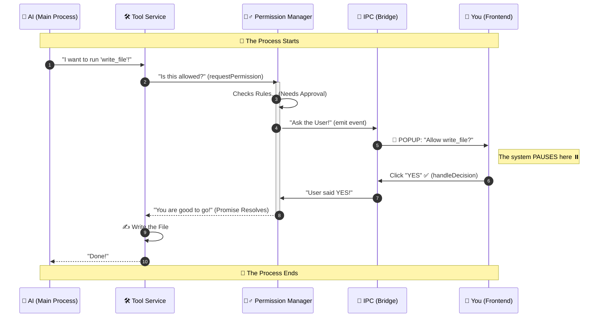

```mermaid
sequenceDiagram
    autonumber
    
    participant AI as 🤖 AI (Main Process)
    participant Tool as 🛠️ Tool Service
    participant Guard as 👮‍♂️ Permission Manager
    participant IPC as 🔌 IPC (Bridge)
    participant User as 👤 You (Frontend)

    Note over AI, User: 🏁 The Process Starts

    AI->>Tool: "I want to run 'write_file'!"
    
    Tool->>Guard: "Is this allowed?" (requestPermission)
    activate Guard
    
    Guard->>Guard: Checks Rules... (Needs Approval)
    Guard->>IPC: "Ask the User!" (emit event)
    IPC->>User: 🔔 POPUP: "Allow write_file?"
    
    Note right of User: The system PAUSES here ⏸️
    
    User->>IPC: Click "YES" ✅ (handleDecision)
    IPC->>Guard: "User said YES!"
    
    Guard-->>Tool: "You are good to go!" (Promise Resolves)
    deactivate Guard
    
    Tool->>Tool: ✍️ Write the File
    Tool-->>AI: "Done!"
    
    Note over AI, User: 🏁 The Process Ends
```